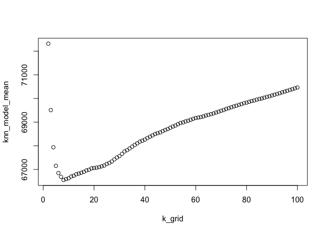

Q1 Saratoga
================
Simran, Swatee & David
06/03/2020

\#Variables defined

    ## 
    ## Call:
    ## lm(formula = price ~ lotSize + age + livingArea + pctCollege + 
    ##     bedrooms + fireplaces + heating + bathrooms + rooms + fuel + 
    ##     centralAir + new, data = SaratogaHouses)
    ## 
    ## Residuals:
    ##     Min      1Q  Median      3Q     Max 
    ## -232675  -39793   -7479   27980  527688 
    ## 
    ## Coefficients:
    ##                          Estimate Std. Error t value Pr(>|t|)    
    ## (Intercept)             28979.353  12211.083   2.373 0.017744 *  
    ## lotSize                  9205.723   2419.144   3.805 0.000147 ***
    ## age                        24.739     65.864   0.376 0.707251    
    ## livingArea                 92.817      5.045  18.398  < 2e-16 ***
    ## pctCollege                285.639    165.408   1.727 0.084370 .  
    ## bedrooms               -15765.027   2882.327  -5.470 5.18e-08 ***
    ## fireplaces                447.764   3390.000   0.132 0.894934    
    ## heatinghot water/steam -10143.120   4744.072  -2.138 0.032653 *  
    ## heatingelectric         -4563.939  13999.959  -0.326 0.744467    
    ## bathrooms               22246.793   3818.786   5.826 6.78e-09 ***
    ## rooms                    3342.851   1092.989   3.058 0.002259 ** 
    ## fuelelectric           -12268.828  13776.602  -0.891 0.373293    
    ## fueloil                 -9198.048   5391.278  -1.706 0.088171 .  
    ## centralAirNo           -16781.825   3920.677  -4.280 1.97e-05 ***
    ## new                    -17560.985   7835.720  -2.241 0.025144 *  
    ## ---
    ## Signif. codes:  0 '***' 0.001 '**' 0.01 '*' 0.05 '.' 0.1 ' ' 1
    ## 
    ## Residual standard error: 66210 on 1713 degrees of freedom
    ## Multiple R-squared:  0.5513, Adjusted R-squared:  0.5477 
    ## F-statistic: 150.4 on 14 and 1713 DF,  p-value: < 2.2e-16

    ## 
    ## Call:
    ## lm(formula = price ~ lotSize + pctCollege + heating + bathrooms + 
    ##     bedrooms + rooms + fuel + centralAir + new + landValue + 
    ##     new * lotSize + centralAir * heating + pctCollege * age + 
    ##     landValue * fuel + heating * bedrooms, data = SaratogaHouses)
    ## 
    ## Residuals:
    ##     Min      1Q  Median      3Q     Max 
    ## -241269  -39741   -7248   30640  409563 
    ## 
    ## Coefficients:
    ##                                       Estimate Std. Error t value Pr(>|t|)
    ## (Intercept)                          2.355e+04  1.522e+04   1.547  0.12203
    ## lotSize                              9.912e+03  2.385e+03   4.157 3.39e-05
    ## pctCollege                          -1.589e+02  2.216e+02  -0.717  0.47341
    ## heatinghot water/steam               2.819e+04  2.069e+04   1.362  0.17329
    ## heatingelectric                     -1.585e+04  2.261e+04  -0.701  0.48330
    ## bathrooms                            4.918e+04  3.201e+03  15.363  < 2e-16
    ## bedrooms                             5.006e+03  3.134e+03   1.597  0.11043
    ## rooms                                8.852e+03  9.575e+02   9.245  < 2e-16
    ## fuelelectric                        -3.069e+04  1.520e+04  -2.019  0.04360
    ## fueloil                              7.914e+03  6.941e+03   1.140  0.25436
    ## centralAirNo                        -1.763e+04  4.174e+03  -4.224 2.53e-05
    ## new                                 -2.245e+04  1.023e+04  -2.193  0.02843
    ## landValue                            1.084e+00  5.063e-02  21.418  < 2e-16
    ## age                                 -4.265e+02  2.747e+02  -1.552  0.12076
    ## lotSize:new                          7.574e+03  1.454e+04   0.521  0.60249
    ## heatinghot water/steam:centralAirNo  6.632e+03  1.337e+04   0.496  0.62006
    ## heatingelectric:centralAirNo         2.554e+04  1.053e+04   2.426  0.01539
    ## pctCollege:age                       6.556e+00  5.135e+00   1.277  0.20189
    ## fuelelectric:landValue               5.938e-01  2.423e-01   2.451  0.01434
    ## fueloil:landValue                   -2.328e-01  1.846e-01  -1.261  0.20746
    ## heatinghot water/steam:bedrooms     -1.263e+04  4.692e+03  -2.692  0.00718
    ## heatingelectric:bedrooms             2.047e+03  5.975e+03   0.343  0.73190
    ##                                        
    ## (Intercept)                            
    ## lotSize                             ***
    ## pctCollege                             
    ## heatinghot water/steam                 
    ## heatingelectric                        
    ## bathrooms                           ***
    ## bedrooms                               
    ## rooms                               ***
    ## fuelelectric                        *  
    ## fueloil                                
    ## centralAirNo                        ***
    ## new                                 *  
    ## landValue                           ***
    ## age                                    
    ## lotSize:new                            
    ## heatinghot water/steam:centralAirNo    
    ## heatingelectric:centralAirNo        *  
    ## pctCollege:age                         
    ## fuelelectric:landValue              *  
    ## fueloil:landValue                      
    ## heatinghot water/steam:bedrooms     ** 
    ## heatingelectric:bedrooms               
    ## ---
    ## Signif. codes:  0 '***' 0.001 '**' 0.01 '*' 0.05 '.' 0.1 ' ' 1
    ## 
    ## Residual standard error: 63290 on 1706 degrees of freedom
    ## Multiple R-squared:  0.5917, Adjusted R-squared:  0.5866 
    ## F-statistic: 117.7 on 21 and 1706 DF,  p-value: < 2.2e-16

\#Averaging the out-of-sample rmse

    ## [1] 66065.01

    ## [1] 63831.35

\#KNN (Non-parametric model)

\#Plot KNN vs RMSE
<!-- -->

\#Summary: I found that variables telling the same thing could be
eliminated. For example, if you just want to know if the house is new or
not then just knowing the age is sufficient and makes the binary
variable ‘new’ unecessary to know. Having said this I couldn’t eliminate
rooms because it seems like bathrooms and bedrooms are not the only type
of rooms looked out for when deciding the former’s number in a house. I
tested if newer houses affect lot size and found that they increase
pricing. I also tested if heating (hot air) affected the central air
enough to affect pricing and found that it did. It looks like age of the
house is correlated with the percentage of college graduates residing in
the neighbourhood and the higher either of those numbers, the higher
would the price be. The fuel availability is correlated with the land
value and that in turn affects the price as well.
